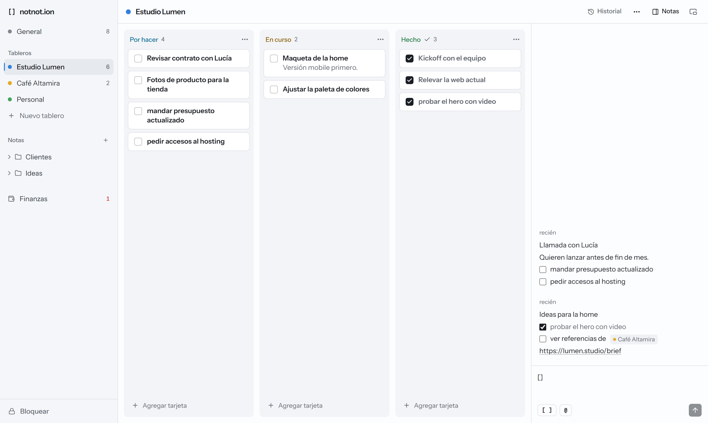
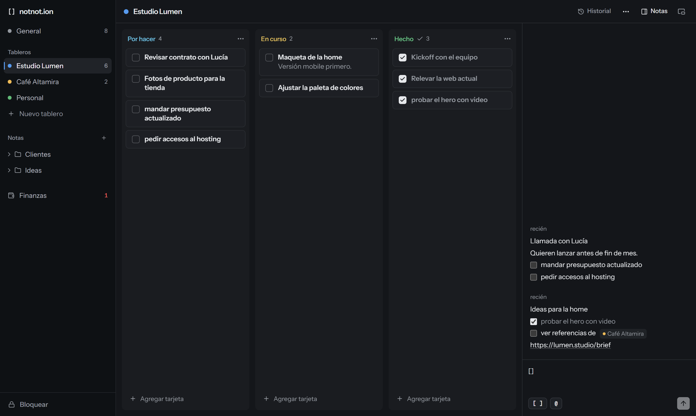
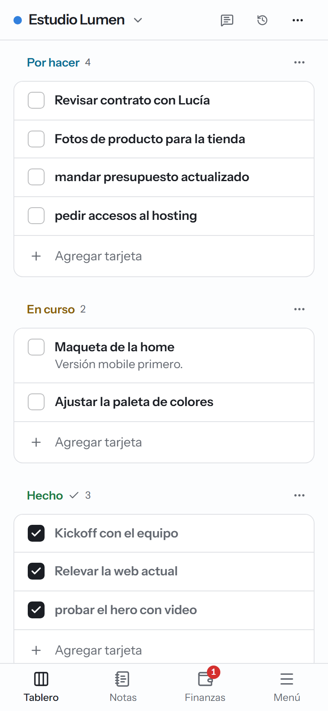
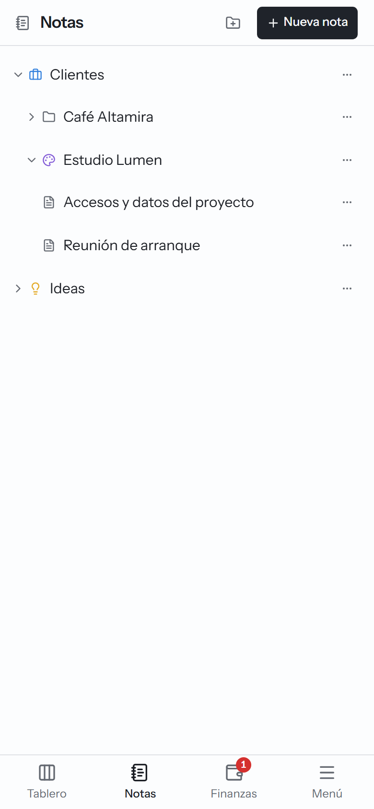
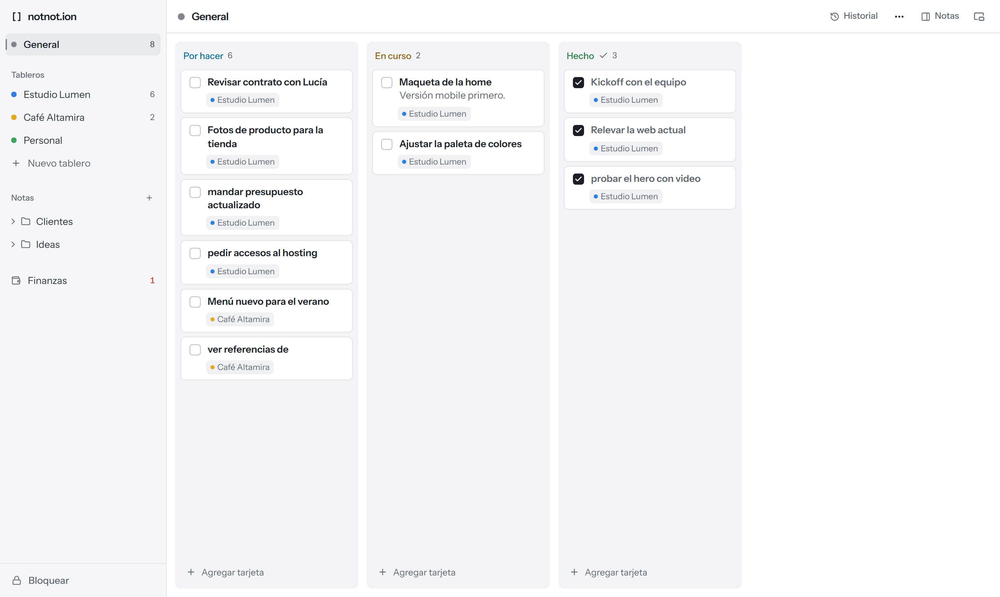
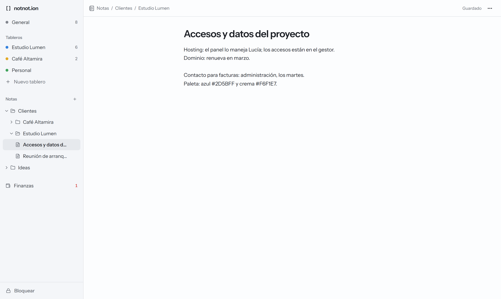
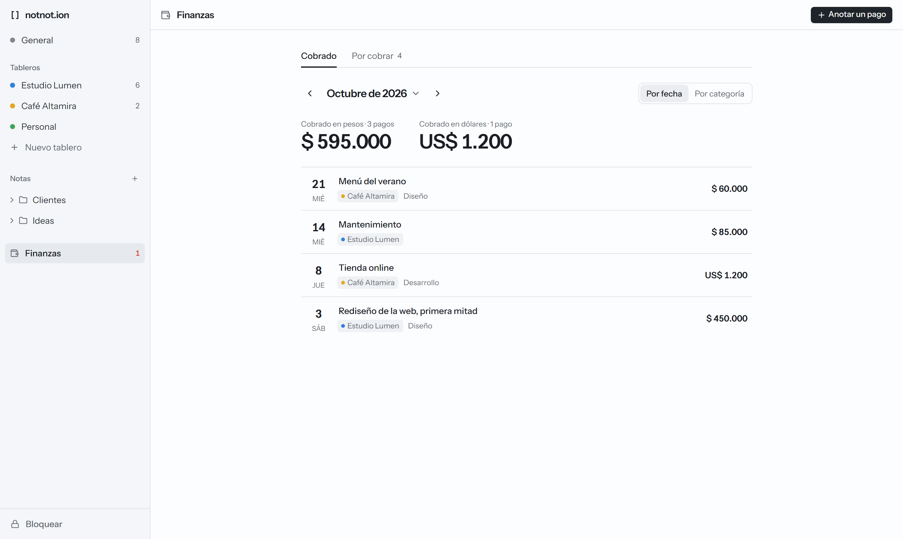
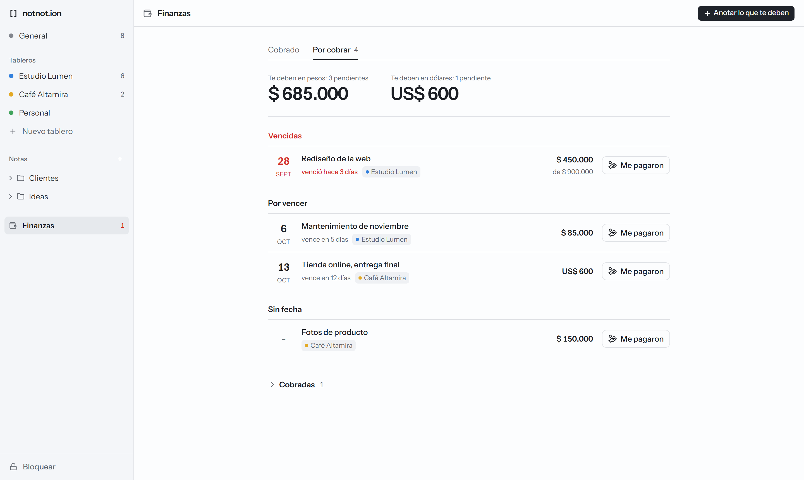

# notnot.ion

App personal para organizar el laburo por cliente. Cada cliente o categoría tiene su tablero kanban y, al lado, un panel de notas rápidas: escribís como en un chat con vos mismo y cada línea que empieza con `[]` se convierte en tarjeta.

Un solo usuario, sin cuentas: la app se abre con un código. Funciona en la web y se instala como PWA en el celu y en la compu.



| Oscuro                                              | Celu: tablero                                           | Celu: notas                                         |
| --------------------------------------------------- | ------------------------------------------------------- | --------------------------------------------------- |
|  |  |  |

## Cómo se usa

- **Tableros**: uno por cliente o categoría, con columnas "Por hacer", "En curso" y "Hecho" (podés agregar, renombrar y elegir cuál es la de terminadas).
- **General**: siempre está arriba. Junta las tarjetas de todos los tableros por estado, cada una con el chip de su tablero, y guarda lo que no es de ningún cliente. Arrastrar una tarjeta a otra columna le cambia el estado en su tablero.
- **Tarjetas**: se crean al pie de cada columna, se tildan con su checkbox (igual que desde la nota) y se mueven arrastrando a cualquier parte de la columna (con el mouse, con espacio y flechas, o con un toque largo en el celu: quedarse en el borde pasa a la columna de al lado) o desde el detalle con "Mover a…".
- **Imágenes**: en el detalle de una tarjeta, pegá una captura (Ctrl+V), arrastrá una imagen o tocá "Adjuntar" (en el celu, galería o cámara). Se achican antes de subirse, se agrandan al tocarlas y son privadas: solo se ven con el candado abierto.
- **Notas**: escribís en el panel de la derecha (en el celu, en la pestaña "Notas"). El composer ya arranca con `[] `: escribís, das Enter y se crea la tarjeta, listo para la siguiente. Cada línea que empieza con `[]`, `[ ]`, `- []`, `- [ ]` o `* [ ]` se vuelve tarjeta al final de "Por hacer"; para una nota común, borrás los corchetes. Con `@tablero` la mandás a otro tablero; sin `@`, queda en el tablero donde escribís. Abajo del composer se ve antes de enviar: "2 tareas → Pepito, General".
- Tildar una línea de la nota manda la tarjeta a "Hecho"; moverla en el tablero actualiza el tilde. Borrar una nota deja sus tarjetas.
- **Notas en otra ventana**: el botón al lado de "Notas" las abre solas en una ventana chica, con un selector de tablero arriba, para tenerlas al costado en una reunión. En Windows, PowerToys la deja siempre encima con Win+Ctrl+T.
- **Historial**: cada día arranca con "Hecho" vacío. Lo terminado antes de hoy pasa al Historial (botón en el header), agrupado por día; en General se ve el de todos los tableros.
- **Sección Notas** (en la sidebar, abajo de los tableros): para lo que no es una tarea. Carpetas con carpetas adentro y notas con título y texto, que se guardan solas mientras escribís. Se crean, renombran, mueven ("Mover a…") y borran desde el "…" de cada una.
- **Finanzas → Cobrado**: los pagos que te hicieron, en pesos o dólares, organizados por mes. Cada uno con fecha, monto, cliente (uno de los tableros), categoría, descripción y comprobantes. Arriba, lo cobrado en el mes por moneda; la lista se ve por fecha o agrupada por categoría.
- **Finanzas → Por cobrar**: lo que te deben, con el día que vence. Lo vencido queda arriba y marcado, y en la sidebar, al lado de Finanzas, ves cuánto vence hoy o ya venció. "Me pagaron" anota el pago ya completo (si fue una parte, cambiás el monto y queda lo que falta); cuando está todo, pasa a "Cobradas" con la lista de sus pagos.



| Sección Notas                                           | Finanzas                                                |
| ------------------------------------------------------- | ------------------------------------------------------- |
|  |  |



## Stack

Monorepo con pnpm:

| Paquete           | Qué tiene                                                                                    |
| ----------------- | -------------------------------------------------------------------------------------------- |
| `apps/web`        | React + TypeScript + Vite, Tailwind, shadcn/ui, TanStack Query, React Router, dnd-kit y PWA. |
| `apps/api`        | Express 5 + TypeScript, Prisma y Postgres (Neon).                                            |
| `packages/shared` | Schemas Zod, parser de notas, slugs y orden (fractional indexing).                           |

Tests con Vitest y Supertest; e2e con Playwright.

## Cómo correrlo

Necesitás Node 24 (está en `.nvmrc`) y pnpm.

```bash
pnpm install
cp .env.example .env   # completá las variables (ver abajo)
pnpm db:migrate        # crea las tablas en la base
pnpm db:seed           # crea el tablero General
pnpm dev               # web en http://localhost:5173 y API en :3001
```

En desarrollo, Vite manda `/api` a la API: web y API quedan en el mismo origen, igual que en producción. El código para entrar es el `APP_SECRET` del `.env`.

### Variables de entorno

| Variable                | Para qué                                                                               |
| ----------------------- | -------------------------------------------------------------------------------------- |
| `DATABASE_URL`          | Conexión pooled de Neon. La usa la app.                                                |
| `DIRECT_URL`            | Conexión directa de Neon. La usa Prisma para migrar.                                   |
| `APP_SECRET`            | El código del candado: una frase de 4 o más palabras.                                  |
| `SESSION_SECRET`        | Firma la cookie de sesión. Rotarlo cierra todas las sesiones.                          |
| `BLOB_READ_WRITE_TOKEN` | Store privado de Vercel Blob (imágenes y comprobantes). En local, el del store de dev. |

## Scripts

| Comando                              | Qué hace                                                                 |
| ------------------------------------ | ------------------------------------------------------------------------ |
| `pnpm dev`                           | Levanta web y API juntas.                                                |
| `pnpm check`                         | Lint, typecheck y tests. Tiene que pasar antes de cada commit.           |
| `pnpm build`                         | Build de producción de la web y bundle de la API.                        |
| `pnpm e2e`                           | Tests e2e con Playwright (incluye la PWA contra el build de producción). |
| `pnpm test`                          | Tests unitarios (Vitest).                                                |
| `pnpm lint`                          | ESLint y Prettier.                                                       |
| `pnpm typecheck`                     | TypeScript en todos los paquetes.                                        |
| `pnpm format`                        | Formatea todo con Prettier.                                              |
| `pnpm db:migrate`                    | Crea y aplica migraciones (Prisma).                                      |
| `pnpm db:seed`                       | Crea General si no existe.                                               |
| `pnpm db:studio`                     | Abre Prisma Studio.                                                      |
| `pnpm --filter @notnot/web icons`    | Regenera los íconos de la PWA desde `apps/web/public/icon.svg`.          |
| `pnpm --filter @notnot/web capturas` | Regenera estas capturas (con la app levantada).                          |

## Deploy

Vercel sirve la web y la API en el mismo origen: `pnpm build:vercel` aplica las migraciones, crea General si no existe, hace el build y arma `.vercel/output` con la web estática y la API como una función (`/api/*`). La configuración está en `vercel.json` y `scripts/build-vercel.mjs`.

Neon tiene un branch `dev` para local y previews, y `production` (el principal) para producción. Las imágenes van a Vercel Blob privado, también separado: `notnot-ion-dev` para local y previews, `notnot-ion-prod` para producción. El repo está conectado a Vercel: cada push a `main` despliega a producción y cada rama tiene su preview.

## Instalarla

- **Compu (Chrome o Edge)**: "Instalar app" en la barra lateral, o el ícono de instalar en la barra de direcciones.
- **Android**: "Instalar app" en el menú de tableros, o "Agregar a la pantalla principal" desde el navegador.
- **iPhone**: en Safari, Compartir → "Agregar a inicio". La app instalada tiene su propio almacenamiento: puede pedirte el código otra vez.

Con la app instalada, tocar y mantener el ícono ofrece "Nueva nota": abre General listo para escribir.

## Documentación

- [`docs/SPEC.md`](docs/SPEC.md): qué hace la app, modelo, API, UI y fases.
- [`docs/PROGRESO.md`](docs/PROGRESO.md): en qué fase está, decisiones y pendientes.
